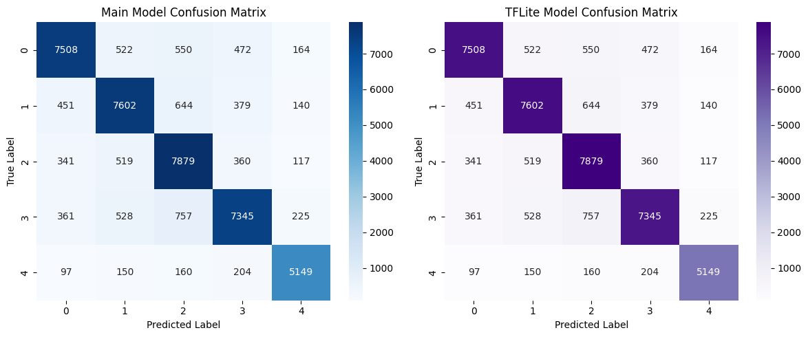
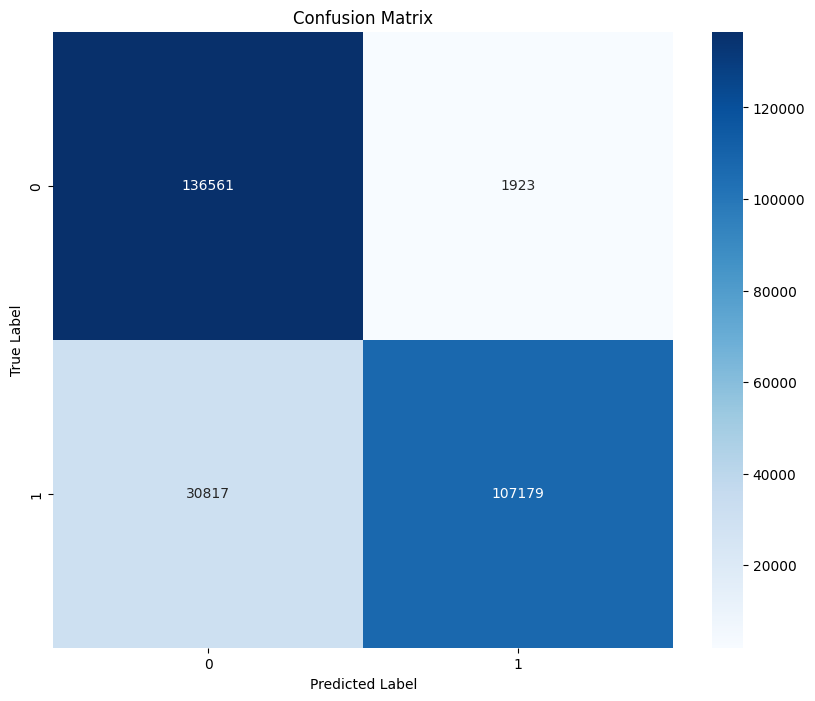

# BCI Project

This project involves two main applications utilizing Brain-Computer Interface (BCI) technology:
### Brain-Computer Interface (BCI) with Motor Imagery

A Brain-Computer Interface (BCI) is a technology that enables direct communication between the brain and external devices. It leverages brain signals, typically captured through electroencephalography (EEG), to interpret user intentions and translate them into commands. One common application of BCI is in motor imagery, where users imagine specific motor actions (e.g., moving a limb) to generate distinct brainwave patterns that can be decoded and used to control external devices.

In our project, we utilized motor imagery to control motion. We employed the Emotiv EPOC X headset, which provides 14 channels of EEG data. This device captures brain signals from various locations on the scalp, allowing us to interpret motor intentions with high precision. The data obtained through the Emotiv EPOC X was essential for training our models, enabling them to accurately classify different motion-related intentions based on the user's brain activity.

1. **Motion Control**
2. **Stress Detection**

## Applications Overview

### 1. Motion Control
This application is designed to interpret brain signals to control motion. The data source for this application is based on the paper *"Converting your thoughts to texts: Enabling brain typing via deep feature learning of EEG signals."* The corresponding dataset is available in the following GitHub repository: [Brain Typing GitHub Repository](https://github.com/xiangzhang1015/Brain_typing?tab=readme-ov-file).

In this application, the "center" label was not used. Additionally, data augmentation was applied to the original data to enhance the model's robustness. The following functions were used for augmentation:

```python
def add_noise(eeg_data, noise_level=0.05):
    noise = np.random.normal(0, noise_level, eeg_data.shape)
    noisy_data = eeg_data + noise
    return noisy_data

def add_baseline_drift(eeg_data, drift_level=0.5):
    drift = np.random.normal(0, drift_level, eeg_data.shape)
    drifted_data = eeg_data + drift
    return drifted_data
```
#### Labels for Motion Control:
The following actions are identified in the motion control application:

| Action ID | Action Name   |
|-----------|---------------|
| 1         | up            |
| 2         | down          |
| 3         | left          |
| 4         | right         |
| 5         | middle        |
| 6         | eye close     |

You can explore the implementation details in the following notebook: [Motion Control Notebook](https://github.com/NeuroSafe-Drive/NeuroSafe-Drive-System/blob/Brain-computer-Interface/motion.ipynb).

#### Results 
- Main Model Accuracy: 83.25%
- TFLite Model Accuracy: 83.25%
- 
### 2. Stress Detection
The stress detection application analyzes brain signals to determine the stress levels of the user. The data for this application comes from the *STEW: Simultaneous Task EEG Workload Dataset,* which can be accessed through the following link: [STEW Dataset on IEEE DataPort](https://ieee-dataport.org/open-access/stew-simultaneous-task-eeg-workload-dataset).

#### Labels for Stress Detection:
The labels for the stress detection application are as follows:

- `0`: Unstressed
- `1`: Stressed

You can explore the implementation details in the following notebook: [Stress Detection Notebook](https://github.com/NeuroSafe-Drive/NeuroSafe-Drive-System/blob/Brain-computer-Interface/stress.ipynb).

#### Results 
- Main Model Accuracy: 88.16%
- TFLite Model Accuracy: 100%
- 

## Data Sources and Preprocessing

Both datasets used in this project are preprocessed and provided in this [Google Drive link](https://drive.google.com/drive/folders/1d4sSMIGzQq_d-SoNrowMDIJ8cjvrVDNM).

## Handling Data 
- Normalization for each subject seperatly 
- Converting Raw EEG data to 3D to capture SpatioTemporal features across the electrodes 


### Warning: Emotiv EPOC X Developer API License Requirement

Please note that the Emotiv EPOC X does not provide real-time raw EEG data acquisition without a Developer API license. This license costs $1250 per seat per year for students, making it a costly option for applications requiring real-time data. Therefore, it is not recommended for this type of application.

Instead, a free API alternative is available, which can be accessed through the following GitHub repository: [Emotiv LSL API](https://github.com/vtr0n/emotiv-lsl).

